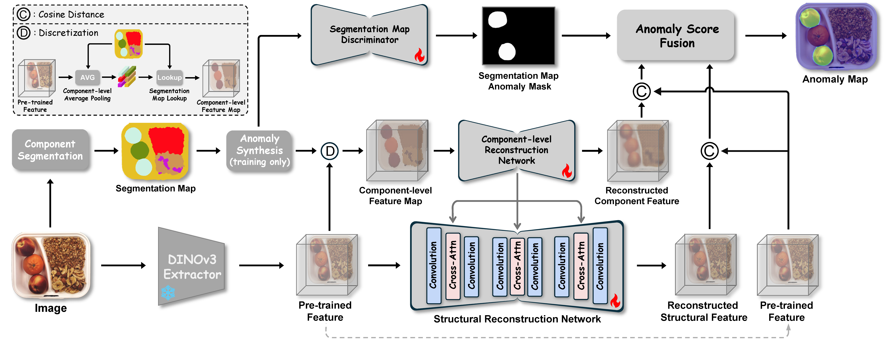

# LogiCo
Official implementation of ["LogiCo: A Unified Framework for Logical and Structural Anomaly Detection (ECCV 2026)"]()  


LogiCo is a unified framework for logical and structural anomaly detection that employs a novel component-level feature reconstruction technique to capture inter-component logical constraints. Specifically, LogiCo maps pre-trained image features into a discrete component-level feature space and performs collaborative feature reconstruction at both the component and patch levels, enabling effective detection of both logical and structural anomalies. Furthermore, to address the specific challenge of count-related logical anomalies, we integrate a segmentation-map discriminator that extends the model’s capability to identify quantitative inconsistencies. LogiCo achieves state-of-the-art performance on multiple logical and structural anomaly detection benchmarks.

    
<div align=center></div>  
 
  
## 🔧 Installation  
To run experiments, first clone the repository and install `requirements.txt`.

```
$ git clone https://github.com/cnulab/LogiCo.git
$ cd LogiCo
$ pip install -r requirements.txt
```
### Download Pre-trained Models  
Request [DINOv3](https://ai.meta.com/resources/models-and-libraries/dinov3-downloads/) weights, and download DINOv3-B/16 (dinov3_vitb16_pretrain_lvd1689m-73cec8be.pth), DINOv3-L/16 (dinov3_vitl16_pretrain_lvd1689m-8aa4cbdd.pth), and DINOv3-based dino.txt (dinov3_vitl16_dinotxt_vision_head_and_text_encoder-a442d8f5.pth). Place them under the [`ckpt`](ckpt/) directory.  
  
### Download Datasets  
- **MVTec-LOCO [[Official]](https://www.mvtec.com/research-teaching/datasets/mvtec-loco-ad))**
- **MVTec-AD [[Official]](https://www.mvtec.com/company/research/datasets/mvtec-ad/)**  
- **VisA [[Official]](https://github.com/amazon-science/spot-diff)**
- **Real-IAD [[Official]](https://realiad4ad.github.io/Real-IAD/)**

Place them under the [`data`](data/) folder and perform preprocessing. Please refer to [data/README](data/README.md).  


## 🚀 Experiments  
Use the following command for component segmentation, taking `Breakfast_box` from `MVTec-LOCO` as an example:  
```
$ python create_segmentation_maps.py --dataset mvtec_loco --category breakfast_box
```
You can skip this step, download the segmentation maps from the link below, and place them in the [`data`](data/) folder:
- **[mvtec_loco segmentations](https://drive.google.com/file/d/1oUcC3O_2-T6TccEdCEC4VBk9mChIffAm/view?usp=drive_link)**
- **[mvtec segmentations](https://drive.google.com/file/d/183KJr-mFXqaZkIo6grc6ZG47loa_XPqt/view?usp=drive_link)**  
- **[visa segmentations](https://drive.google.com/file/d/1w8OLhOdh5vt39nlwuBxdkM4W4Rxl1z4Y/view?usp=drive_link)**
- **[real-iad segmentations](https://drive.google.com/file/d/1oIpjoi9jKJvlZ_LeIKSg6qp_UmYhUsa-/view?usp=drive_link)**
  
Train LogiCo using the following command:
```
$ python train_logico.py --dataset mvtec_loco --category breakfast_box  --save_dir saved_results
```
Evaluation and visualization:  
```
$ python evaluation.py --dataset mvtec_loco --category breakfast_box  --save_dir saved_results
```
The complete running scripts are provided in the [`runs`](runs/) folder.  

  
## 🔗 Citation  

If this work is helpful to you, please cite it as:
```
comming soon.
```
